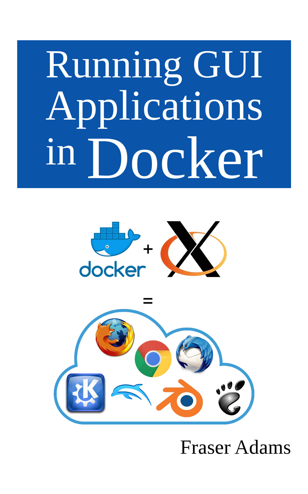

This is the code repository for a book providing a detailed step-by-step guide to packaging and running GUI applications as Docker containers.

- US [http://www.amazon.com/dp/B08DSX72JV](http://www.amazon.com/dp/B08DSX72JV)
- UK [http://www.amazon.co.uk/dp/B08DSX72JV](http://www.amazon.co.uk/dp/B08DSX72JV)
- DE [http://www.amazon.de/dp/B08DSX72JV](http://www.amazon.de/dp/B08DSX72JV)
- FR [http://www.amazon.fr/dp/B08DSX72JV](http://www.amazon.fr/dp/B08DSX72JV)
- ES [http://www.amazon.es/dp/B08DSX72JV](http://www.amazon.es/dp/B08DSX72JV)
- IT [http://www.amazon.it/dp/B08DSX72JV](http://www.amazon.it/dp/B08DSX72JV)
- JP [http://www.amazon.co.jp/dp/B08DSX72JV](http://www.amazon.co.jp/dp/B08DSX72JV)
- CA [http://www.amazon.ca/dp/B08DSX72JV](http://www.amazon.ca/dp/B08DSX72JV)

This book provides a comprehensive step-by-step guide to packaging and running GUI applications as Docker containers.

The book sets the scene with some simple and well-known X11 applications hosted locally, before tackling more advanced topics such as enabling GPU acceleration in containers to support OpenGL, CUDA and OpenCL applications.

The book also covers several less-frequently discussed topics such as remote accelerated rendering via VirtualGL to enable Cloud hosting of high-end GUI applications, D-bus integration, AppArmor, Bluetooth, realtime scheduling, and running full 3D accelerated virtual desktops in containers.